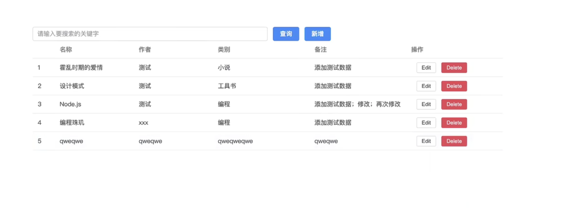
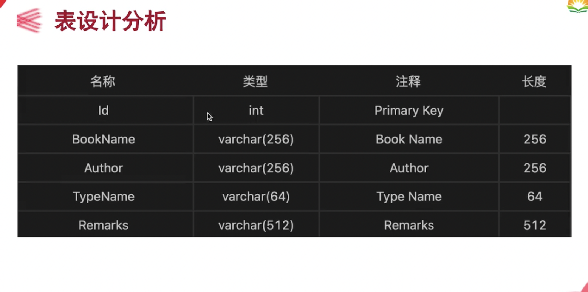
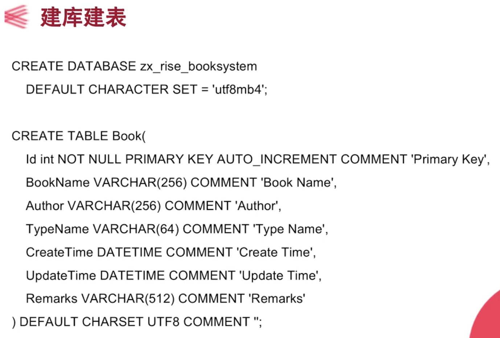

express-session会自动返回设置cookie(sessionid)
后端 登录 判断为login/logout =》next
前端登录 校验成功直接push主页
前端退出 相应后端，destroySession clearCookie
前端退出 push('login')

前端 路由导航 判断每页的 cookie存在且有效

mysql配置my.cnf https://www.cnblogs.com/twq46/archive/2022/07/16/16484537.html

> 使用lang="less"
>
> 其实编译器自带lessc编译器
>
> `lessc test.less test.css `

mainbox ---info---> addbox

info table的一行数据

addbox	

​	监听info，赋值给==formData==（表单的值），提交给数据库的

info是每一行元素的编辑按钮点击后才能将一行内容赋值给info

新增addBook

传值info.id（时间戳）,其余ID属性为空

打开的还是addbox组件

